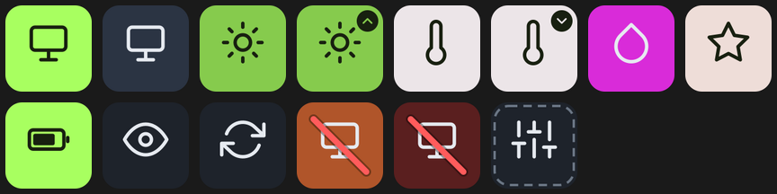

# LimeLight OpenDeck plugin

[](https://github.com/Chimi6/limelight-opendeck-plugin/actions/workflows/ci.yml)
[](https://github.com/Chimi6/limelight-opendeck-plugin/releases/latest)
[](LICENSE)

Control Elgato lights from a Stream Deck on Linux. A native [OpenDeck](https://github.com/nekename/OpenDeck) plugin for the [LimeLight](https://github.com/Chimi6/limelight-linux-elgato-lights-controller) daemon. Single Rust binary, no Node or Wine, works with the OpenDeck Flatpak.



## Requirements

- [OpenDeck](https://github.com/nekename/OpenDeck) 2.14 or newer.
- [LimeLight](https://github.com/Chimi6/limelight-linux-elgato-lights-controller), which provides the `keylightd` daemon the plugin talks to. Install it and pair your lights there first. The plugin bundles a copy of `keylightd` and starts it if nothing is running on port 9124, but LimeLight is where lights, aliases and groups are managed.

## Setup

### Option 1: install from within OpenDeck

1. Open OpenDeck and go to the Plugins tab.
2. Paste this URL into the install field and confirm:

   ```
   https://github.com/Chimi6/limelight-opendeck-plugin/releases/latest/download/limelight-opendeck.zip
   ```

   Once the plugin is listed in the OpenDeck plugin browser you can also find it there by searching for LimeLight.

### Option 2: install from a downloaded zip

1. Download `limelight-opendeck-<version>.zip` from the [latest release](https://github.com/Chimi6/limelight-opendeck-plugin/releases/latest).
2. In OpenDeck open the Plugins tab, choose install from file, and pick the zip. Do not unzip it first.

### Then

Drag an action from the LimeLight category onto a key or dial and pick a target in its settings.

## Features

| Action | What it does |
|---|---|
| Power | Toggle, turn on or turn off a light, a group or all lights |
| Set Brightness | Jump to a brightness level |
| Adjust Brightness | Step brightness up or down |
| Set Temperature | Jump to a colour temperature (2900 to 7000 K) |
| Adjust Temperature | Step warmer or cooler |
| Set Color | Set a Light Strip colour |
| Preset | Apply a saved power, brightness and temperature (or colour) combination |
| Battery | Show the battery level of a Key Light Mini |
| Identify | Blink a light |
| Scan | Search the network for lights |
| Brightness Dial | Stream Deck+ dial: rotate to adjust, push or tap to toggle, hold to reset |
| Temperature Dial | Same for colour temperature, with a warm-to-cool gradient bar |

Every action can target one light, a LimeLight group, or all lights. Keys render live from the daemon: lime is on, slate is off, amber means the light is unreachable, dark red means the daemon is down. Brightness and temperature tiles shade with the light's current value, so a key always shows what the light is doing, even after another app changed it.

## Configuration

Global settings stored by OpenDeck: `port` (default 9124, `LIMELIGHT_PORT` is honoured), `pollSeconds` (default 3), `startDaemon` (default true).

Logs are in OpenDeck's plugin log directory, for example `~/.var/app/me.amankhanna.opendeck/data/opendeck/logs/plugins/io.github.chimi6.limelight.sdPlugin.log`.

## Build from source

Requires stable Rust (1.88 or newer), `zip`, `jq` and `curl`.

```sh
packaging/build-plugin.sh            # writes dist/limelight-opendeck-<version>.zip
packaging/build-plugin.sh --install  # also installs into the local OpenDeck plugins directory
```

To release: bump `version` in `Cargo.toml` and `Version` in the manifest to the same value, add a `CHANGELOG.md` section, push a `v<version>` tag. CI builds x86_64 and aarch64 and publishes the zip.

## License

[MIT](LICENSE)
